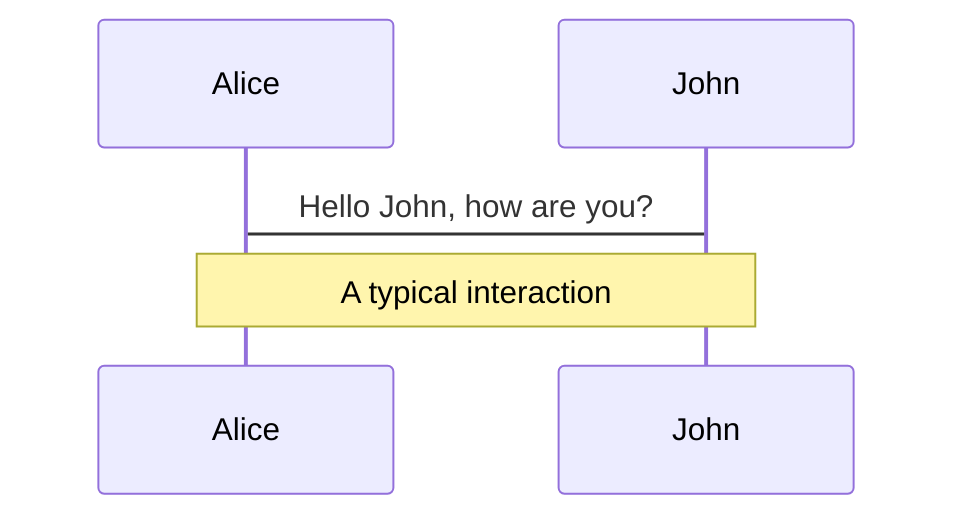
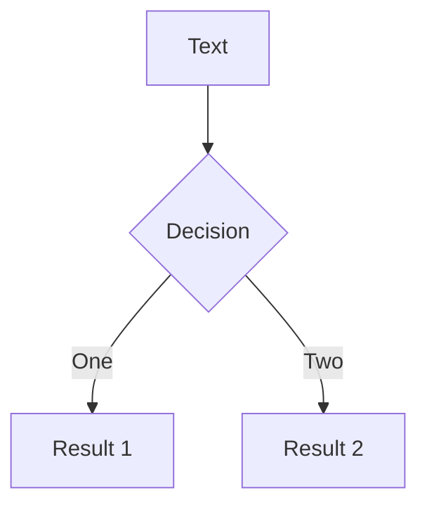
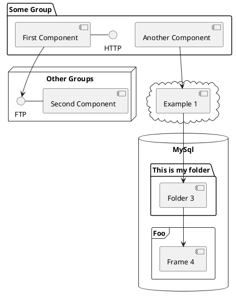

---
# try also 'default' to start simple
theme: seriph
# random image from a curated Unsplash collection by Anthony
# like them? see https://unsplash.com/collections/94734566/slidev
background: https://source.unsplash.com/collection/94734566/1920x1080
# apply any windi css classes to the current slide
class: 'text-center'
# https://sli.dev/custom/highlighters.html
highlighter: shiki
# show line numbers in code blocks
lineNumbers: false
# some information about the slides, markdown enabled
info: |
  ## Slidev Starter Template
  Presentation slides for developers.

  Learn more at [Sli.dev](https://sli.dev)
# persist drawings in exports and build
drawings:
  persist: false
# use UnoCSS
css: unocss
---

# Monorepo

Presentation slides for developers

<div class="pt-12">
  <span @click="$slidev.nav.next" class="px-2 py-1 rounded cursor-pointer" hover="bg-white bg-opacity-10">
    点击下一页 <carbon:arrow-right class="inline"/>
  </span>
</div>

<div class="abs-br m-6 flex gap-2">
  <button @click="$slidev.nav.openInEditor()" title="Open in Editor" class="text-xl icon-btn opacity-50 !border-none !hover:text-white">
    <carbon:edit />
  </button>
  <a href="https://github.com/slidevjs/slidev" target="_blank" alt="GitHub"
    class="text-xl icon-btn opacity-50 !border-none !hover:text-white">
    <carbon-logo-github />
  </a>
</div>

<!--
The last comment block of each slide will be treated as slide notes. It will be visible and editable in Presenter Mode along with the slide. [Read more in the docs](https://sli.dev/guide/syntax.html#notes)
-->

---

# 什么是Monorepo?

<br>
Monorepo是一种项目架构：一个仓库内包含多个开发项目（模块，包），具有良好定义的关系。
<br>


<br>

了解更多[Monorepo](https://monorepo.tools/)

<!--
You can have `style` tag in markdown to override the style for the current page.
Learn more: https://sli.dev/guide/syntax#embedded-styles
-->

<style>
h1 {
  background-color: #2B90B6;
  background-image: linear-gradient(45deg, #4EC5D4 10%, #146b8c 20%);
  background-size: 100%;
  -webkit-background-clip: text;
  -moz-background-clip: text;
  -webkit-text-fill-color: transparent;
  -moz-text-fill-color: transparent;
}
</style>

---

# Monorepo的目录结构
<br>
在 packages 存放多个子项目，每个子项目都有自己的package.json

```
├── packages
|   ├── pkg1
|   |   ├── package.json
|   ├── pkg2
|   |   ├── package.json
├── package.json
```
<br>

相比于MultiRepo（一个项目一个仓库），Monorepo只会创建一个仓库，并在这个一个仓库里管理着多个项目代码.每一个项目有它单独的功能与作用，多个项目之间可能会有引用关系，最后通过最上层的项目进行统一管理

<br>
哪些开源库在用？
<br>

[Vue3](https://github.com/vuejs/core)<br>
[Element-plus](https://github.com/element-plus/element-plus)<br>
[基于Maven的Monorepo项目](https://github.com/kgunnerud/monorepo-maven-example)

---

# Monorepo ≠ Monolith

Monorepo不是简单地code colocation，一个Monorepo项目需要处理好子项目之间的关系。如果一个仓库包含一个庞大的应用程序，而没有对内部离散部分进行划分和封装，那么它只是一个大仓库，而不是Monorepo


---

# Monorepo or Polyrepo ?

<br>

传统的Polyrepo，每个项目都对应单独的一个代码仓库，这样的开发方式带来的弊端有：
- <Link to="6">代码复用</Link>
- <Link to="8">版本管理</Link>
- <Link to="9">项目基建</Link>

<br>

<Link to="10">Why Monorepo ?</Link>
<br>
<br>
<Link to="11">Monorepo tool</Link>


---

# 代码复用

<br>
在维护多个项目的时候，有一些逻辑很有可能会被多次用到.

- 基础的组件
- 工具函数
- 配置文件

常规方法：copy
<br>
产生的问题：如果代码出现bug，改好之后就得去所有使用的地方进行覆盖
<br>
解决方案：抽取除公共逻辑代码，整合成一个基础库，进行发布，一旦需要改动，只需要改动一份代码，然后重新发布上线

---

# 缺点

基础库修改流程：
1. 去修改一个工具函数的代码
2. 发布1.1.1版本的新包
3. 项目中安装新版本的 A。

一个小问题的改动，引发流程重跑，同时多流程中容易出现意外bug

<br>

<Link to="5">Back to Monorepo or Polyrepo</Link>

---

# 版本管理

<br>
在 MultiRepo 的开发方式下，
A工具包版本是 v1.0.0，现在有多个项目都依赖于A工具包，但是A工具包在某次更新的时候发了一个break change 版本，和原来版本的 API 不完全兼容。但是某些依赖于A工具包的项目并没有及时升级A工具包版本，就会导致一些api调用报错。

<br>
<Link to="5">Back to Monorepo or Polyrepo</Link>

---

# 项目基建

<br>
由于在 MultiRepo 当中，各个项目的工作流是割裂的，因此每个项目需要单独配置开发环境、配置 CI 流程、配置部署发布流程等等，甚至每个项目都有自己单独的一套脚手架工具。
其实，很容易发现这些项目里的很多基建的逻辑都是重复的，如果是 10 个项目，就需要维护 10 份基建的流程，逻辑重复不说，各个项目间存在构建、部署和发布的规范不能统一的情况，这样维护起来就更加麻烦了。

<br>
<Link to="5">Back to Monorepo or Polyrepo</Link>

---

# Why Monorepo ?

<br>

1. 一个版本基础库用于所有项目
由于所有的项目放在一个仓库当中，复用起来非常方便，如果有依赖的代码变动，那么用到这个依赖的项目当中会立马感知到。并且所有的项目都是使用最新的代码，不会产生其它项目版本更新不及时的情况。
2. 项目基建成本的降低
所有项目复用一套标准的工具和规范，无需切换开发环境，如果有新的项目接入，也可以直接复用已有的基建流程，比如 CI 流程、构建和发布流程。这样只需要很少的人来维护所有项目的基建，维护成本也大大减低。
3. 团队协作也更加容易
一方面大家都在一个仓库开发，能够方便地共享和复用代码，方便检索项目源码，另一方面，git commit 的历史记录也支持以功能为单位进行提交，之前对于某个功能的提交，需要改好几个仓库，提交多个 commit，现在只需要提交一次，简化了 commit 记录，方便协作。


<br>
<Link to="5">Back to Monorepo or Polyrepo</Link>

---

# Monorepo tool

<br>

---

# With pnpm


```
packages:
  # all packages in direct subdirs of packages/
  - 'packages/*'
  # all packages in subdirs of components/
  - 'components/**'
  # exclude packages that are inside test directories
  - '!**/test/**'
```

<br>

[Learn more](https://pnpm.io/zh/motivation)
---

# 演示


---

Thanks for watching !

---


# Navigation

Hover on the bottom-left corner to see the navigation's controls panel, [learn more](https://sli.dev/guide/navigation.html)

### Keyboard Shortcuts

|     |     |
| --- | --- |
| <kbd>right</kbd> / <kbd>space</kbd>| next animation or slide |
| <kbd>left</kbd>  / <kbd>shift</kbd><kbd>space</kbd> | previous animation or slide |
| <kbd>up</kbd> | previous slide |
| <kbd>down</kbd> | next slide |

<!-- https://sli.dev/guide/animations.html#click-animations -->

<p v-after class="absolute bottom-23 left-45 opacity-30 transform -rotate-10">Here!</p>

---
layout: image-right
image: https://source.unsplash.com/collection/94734566/1920x1080
---

# Code

Use code snippets and get the highlighting directly![^1]

```ts {all|2|1-6|9|all}
interface User {
  id: number
  firstName: string
  lastName: string
  role: string
}

function updateUser(id: number, update: User) {
  const user = getUser(id)
  const newUser = { ...user, ...update }
  saveUser(id, newUser)
}
```

<arrow v-click="3" x1="400" y1="420" x2="230" y2="330" color="#564" width="3" arrowSize="1" />

[^1]: [Learn More](https://sli.dev/guide/syntax.html#line-highlighting)

<style>
.footnotes-sep {
  @apply mt-20 opacity-10;
}
.footnotes {
  @apply text-sm opacity-75;
}
.footnote-backref {
  display: none;
}
</style>

---

# Components

<div grid="~ cols-2 gap-4">
<div>

You can use Vue components directly inside your slides.

We have provided a few built-in components like `<Tweet/>` and `<Youtube/>` that you can use directly. And adding your custom components is also super easy.

```html
<Counter :count="10" />
```

<!-- ./components/Counter.vue -->
<Counter :count="10" m="t-4" />

Check out [the guides](https://sli.dev/builtin/components.html) for more.

</div>
<div>

```html
<Tweet id="1390115482657726468" />
```

<Tweet id="1390115482657726468" scale="0.65" />

</div>
</div>


---
class: px-20
---

# Themes

Slidev comes with powerful theming support. Themes can provide styles, layouts, components, or even configurations for tools. Switching between themes by just **one edit** in your frontmatter:

<div grid="~ cols-2 gap-2" m="-t-2">

```yaml
---
theme: default
---
```

```yaml
---
theme: seriph
---
```


</div>

Read more about [How to use a theme](https://sli.dev/themes/use.html) and
check out the [Awesome Themes Gallery](https://sli.dev/themes/gallery.html).

---
preload: false
---

# Animations

Animations are powered by [@vueuse/motion](https://motion.vueuse.org/).

```html
<div
  v-motion
  :initial="{ x: -80 }"
  :enter="{ x: 0 }">
  Slidev
</div>
```

<div class="w-60 relative mt-6">
  <div class="relative w-40 h-40">
    
    
    
  </div>

  <div
    class="text-5xl absolute top-14 left-40 text-[#2B90B6] -z-1"
    v-motion
    :initial="{ x: -80, opacity: 0}"
    :enter="{ x: 0, opacity: 1, transition: { delay: 2000, duration: 1000 } }">
    Slidev
  </div>
</div>

<!-- vue script setup scripts can be directly used in markdown, and will only affects current page -->
<script setup lang="ts">
const final = {
  x: 0,
  y: 0,
  rotate: 0,
  scale: 1,
  transition: {
    type: 'spring',
    damping: 10,
    stiffness: 20,
    mass: 2
  }
}
</script>

<div
  v-motion
  :initial="{ x:35, y: 40, opacity: 0}"
  :enter="{ y: 0, opacity: 1, transition: { delay: 3500 } }">

[Learn More](https://sli.dev/guide/animations.html#motion)

</div>

---

# LaTeX

LaTeX is supported out-of-box powered by [KaTeX](https://katex.org/).

<br>

Inline $\sqrt{3x-1}+(1+x)^2$

Block
$$
\begin{array}{c}

\nabla \times \vec{\mathbf{B}} -\, \frac1c\, \frac{\partial\vec{\mathbf{E}}}{\partial t} &
= \frac{4\pi}{c}\vec{\mathbf{j}}    \nabla \cdot \vec{\mathbf{E}} & = 4 \pi \rho \\

\nabla \times \vec{\mathbf{E}}\, +\, \frac1c\, \frac{\partial\vec{\mathbf{B}}}{\partial t} & = \vec{\mathbf{0}} \\

\nabla \cdot \vec{\mathbf{B}} & = 0

\end{array}
$$

<br>

[Learn more](https://sli.dev/guide/syntax#latex)

---

# Diagrams

You can create diagrams / graphs from textual descriptions, directly in your Markdown.

<div class="grid grid-cols-3 gap-10 pt-4 -mb-6">







</div>

[Learn More](https://sli.dev/guide/syntax.html#diagrams)

---
src: ./pages/multiple-entries.md
hide: false
---

---
layout: center
class: text-center
---

# Learn More

[Documentations](https://sli.dev) · [GitHub](https://github.com/slidevjs/slidev) · [Showcases](https://sli.dev/showcases.html)
